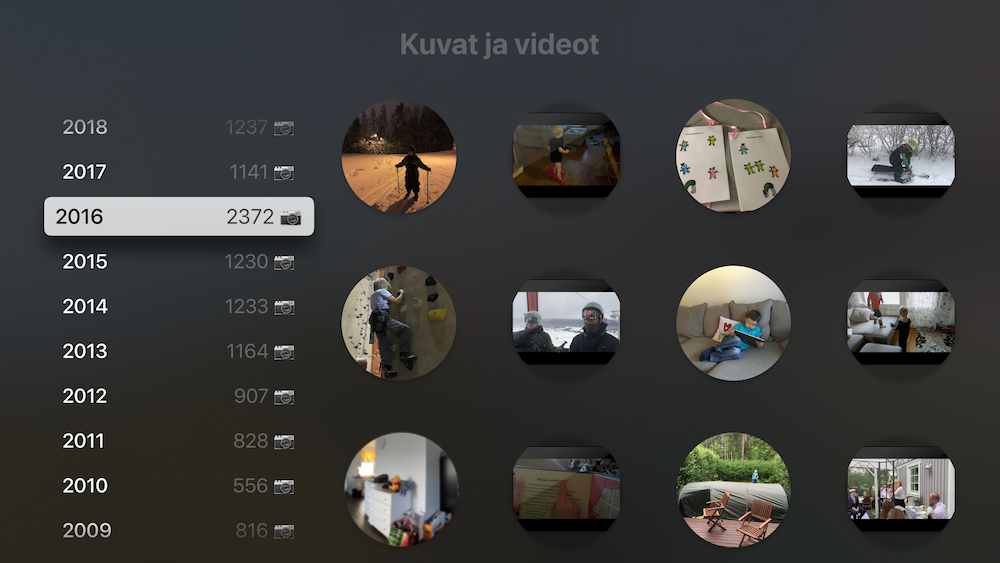
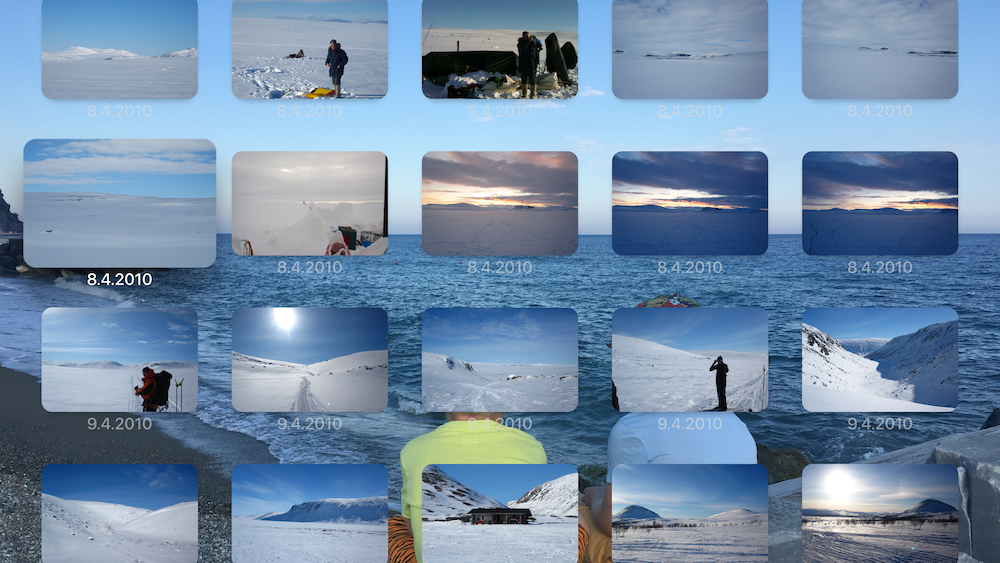
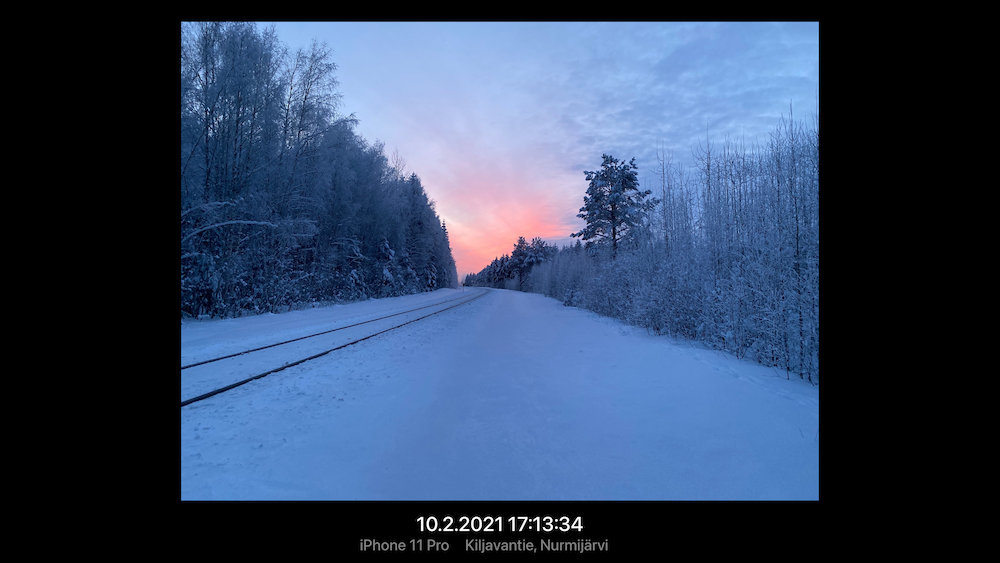

# Home video and photo management solution

_Posted: 11.06.2021_

_Updated: 14.06.2021_

---

Here's an overview of my home video and photo management setup. This is the Xth iteration for the management solution that I've been buiding for several years. The current setup has been in use for about two years. 

I haven't published most of the source code about the current solution because there are too many dependencies and it would require a lot work to make it even remotely generic and usable for somebody else. Maybe someday?

Here are two old iterations:

- [Version 1](../archive/md/photo_management_v1.md)
- [Version 2](../archive/md/photo_management.md)

## Problem: How to watch 4K home videos with Apple TV? Easy enough UI for kids?

- iCloud Photos on Apple TV doesn't support 4K resolution and is slow even with 1080p videos
- Most of the NAS media viewing solutions are too difficult for kids to use

## Solution

Custom Apple TV app, web server and various homegrown tools and scripts. 🍌

### Apple TV app screenshots

Year & month view:



Month view:



Detail view:



## Components

- [Dropbox Plus](https://www.dropbox.com/plus) for cloud storage
- Python script that 
    - uses Dropbox API to move photos and videos from Dropbox `Camera Uploads` folder to `year-month` folders based on file metadata
    - sends info via [push notification](../pics/pushover.png) using [Pushover](https://pushover.net)
    - is based on this previous [Python](https://github.com/jlehikoinen/db-mover/blob/master/db_mover.py) script
- bash script that 
    - clones Dropbox photo and video folders to external disk using `rsync`
    - runs `create_thumbnails.zsh` script that creates thumbnails of videos
    - runs Swift command line tool `DboxMediaHelper` that creates a json file of photo and video metadata
- Apache web server running on a Mac mini
- Custom Apple TV app for displaying photos and videos

### create_thumbnails.zsh

- Enumerates files in video folders
- Creates directory tree if needed
- Uses `qlmanage` command line tool to create thumbnails of videos

### Swift command line tool

- Enumerates files in photo and video folders
- Gets photo and video metadata using Core Graphics APIs
- Utilizes [LocationIQ](https://locationiq.com) API for reverse geocoding photo location
- Diffs contents of existing json file and enumerated metadata and updates json file if needed

### Apple TV app

- uses TVMLKit framework
- downloads json file from the web server
- displays photos and videos using TVMLKit templates

### Excerpt of json metadata file

```
[
  {
    "year" : "2019",
    "month" : "2019-11-kuvat",
    "mediaItems" : [
      {
        "location" : "Petkeleentie, Lahti",
        "city" : "Lahti",
        "timeTaken" : "2019-11-14T16:19:52.000Z",
        "model" : "iPhone 11",
        "path" : "\/Kuvat ja videot\/Kuvat\/2019\/2019-11-kuvat\/2019-11-14 18.19.52.jpg",
        "type" : "photo",
        "coordinates" : {
          "lat" : 61.459541666666667,
          "lon" : 25.79663
        }
      },
      {
        "location" : "Petkeleentie, Lahti",
        "city" : "Lahti",
        "timeTaken" : "2019-11-10T10:27:58.000Z",
        "model" : "iPhone 8",
        "path" : "\/Kuvat ja videot\/Kuvat\/2019\/2019-11-kuvat\/2019-11-10 12.27.58.jpg",
        "type" : "photo",
        "coordinates" : {
          "lat" : 61.459861666666669,
          "lon" : 25.797280000000001
        }
      },
...
```

## Hardware

- Mac mini which runs a web server and all the previously mentioned tools and scripts using LaunchDaemons on a daily/nightly basis

## Future iterations

- Port Apple TV app TVMLKit code to SwiftUI so it can be used with iPads etc.
- Run scripts and tools more frequently => "when needed"

---
